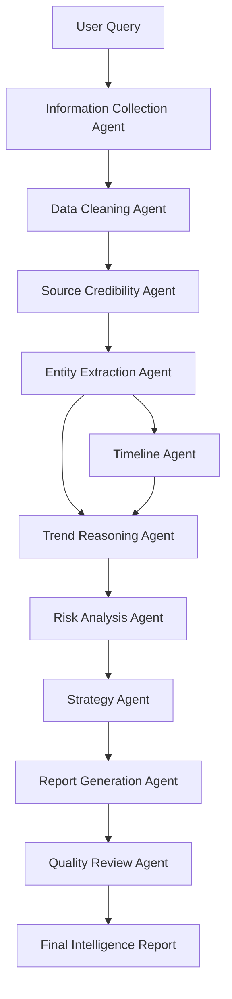
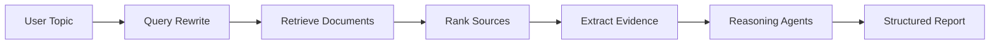

# CivicMind Agent

**CivicMind Agent** 是一个 AI 驱动的公共政策与商业决策情报分析 Skill 原型项目。  
它面向创业者、投资人、企业战略部门、行业研究人员和政策研究者，目标是将分散在政府公告、监管文件、产业报告、新闻资讯、上市公司公告、融资信息、社交媒体和专家观点中的信息，自动整理为可用于决策的结构化情报报告。

本项目不是一个简单的“报告生成器”，而是一个围绕真实研究流程设计的多 Agent 协作系统。它尝试把人工研究中常见的“信息采集、来源判断、内容清洗、实体抽取、趋势分析、风险识别、策略生成和报告输出”拆解为多个可独立运行、可组合、可评估的 Agent 模块，从而构建一个可扩展的 AI 决策研究工作流。

---

## 1. 项目背景

在现实商业决策和政策研究中，信息通常极度分散。一个创业者想判断某个行业是否值得进入，往往需要同时阅读政府政策、监管公告、地方补贴文件、行业报告、融资新闻、竞品官网、招聘信息、财报摘要和市场舆论。

一个投资人想判断某家公司是否具备长期价值，也需要综合分析公司业务、产业趋势、政策环境、融资历史、竞争格局、团队背景、财务变化和潜在风险。传统方式下，这类研究高度依赖人工检索、阅读、摘录、归纳和判断，不仅耗时较长，而且容易出现信息遗漏、来源混杂、结论跳跃和证据链不完整的问题。

CivicMind Agent 的目标是通过多 Agent 工作流，将复杂研究任务拆解成多个阶段，让 AI 不只是直接生成一段回答，而是按照接近咨询研究和投研分析的流程逐步完成任务。

---

## 2. 项目解决的核心痛点

| 痛点 | 具体表现 | CivicMind Agent 的解决方式 |
|---|---|---|
| 信息分散 | 政策、新闻、报告、公告、舆论分布在不同来源 | 通过信息采集 Agent 汇总多源资料 |
| 信息噪声高 | 自媒体、论坛、营销稿、重复报道混杂 | 通过信息清洗 Agent 和可信度评估 Agent 过滤低质量内容 |
| 研究耗时长 | 人工完成一次行业研究可能需要数小时到数天 | 通过多 Agent 流程自动完成结构化分析 |
| 证据链薄弱 | 很多分析只有结论，缺少来源和推理过程 | 通过实体抽取、时间线和证据链模块追踪依据 |
| 风险判断不系统 | 容易只看到机会，忽略政策、合规、竞争和资金风险 | 通过风险识别 Agent 单独生成风险矩阵 |
| 报告格式不统一 | 不同研究人员输出风格差异较大 | 通过报告生成 Agent 输出标准化决策报告 |
| Token 消耗高但难以管理 | 长文本、多来源、多轮分析容易消耗大量 token | 通过模块化 Agent 设计控制每一步上下文和输出 |

---

## 3. 目标用户

| 用户类型 | 使用场景 |
|---|---|
| 创业者 | 判断某个行业是否值得进入，寻找机会窗口和风险边界 |
| 投资人 | 分析公司、赛道、政策变化和行业趋势 |
| 企业战略部门 | 跟踪监管政策、产业变化和竞争对手动态 |
| 政策研究人员 | 整理政策文件、地方试点和产业扶持方向 |
| 咨询顾问 | 快速形成行业研究初稿和客户汇报材料 |
| 中小企业老板 | 判断新业务、新地区、新市场是否值得投入 |

---

## 4. 核心能力

CivicMind Agent 支持将用户输入的行业、公司、地区、政策主题或商业问题，转化为结构化研究报告。

典型输入示例：

```text
分析 AI 法律服务行业是否值得进入，重点关注政策风险、商业化路径、已有竞品和中小律所需求。
```

系统输出内容包括：

| 输出模块 | 内容 |
|---|---|
| Executive Summary | 核心结论摘要 |
| Research Scope | 研究范围和边界 |
| Key Signals | 政策、市场、资本、竞品、舆论信号 |
| Evidence Chain | 证据链和来源权重 |
| Market Opportunity | 机会判断 |
| Risk Matrix | 政策风险、合规风险、竞争风险、商业模式风险 |
| Competitor Map | 主要竞品和差异化分析 |
| Timeline | 关键事件时间线 |
| Strategic Recommendation | 面向不同角色的策略建议 |
| Next Actions | 后续行动清单 |

---

## 5. 多 Agent 工作流

CivicMind Agent 采用多 Agent 协作架构，每个 Agent 负责一个明确阶段。

| Agent | 职责 | 输入 | 输出 |
|---|---|---|---|
| Information Collection Agent | 收集政策、新闻、报告、公告、企业信息 | 用户主题 | 原始资料集合 |
| Data Cleaning Agent | 去重、过滤低质量内容、分类 | 原始资料 | 清洗后的资料池 |
| Source Credibility Agent | 判断来源可信度和信息权重 | 清洗资料 | 来源评分与可信度标签 |
| Entity Extraction Agent | 抽取公司、行业、政策、地区、金额、时间、机构 | 清洗资料 | 结构化实体表 |
| Timeline Agent | 整理关键事件时间线 | 实体和资料 | 时间线 |
| Trend Reasoning Agent | 判断政策、资本、市场和需求趋势 | 证据链和实体表 | 趋势分析 |
| Risk Analysis Agent | 识别政策、合规、竞争、商业、资金和舆论风险 | 趋势分析 | 风险矩阵 |
| Strategy Agent | 根据用户角色生成建议 | 风险与机会判断 | 策略建议 |
| Report Generation Agent | 整合所有模块形成完整报告 | 全部中间结果 | 结构化报告 |
| Quality Review Agent | 检查逻辑链、证据链和结论一致性 | 初版报告 | 审核意见和修订版 |

---

## 6. 系统架构



---

## 7. 长链推理设计

CivicMind Agent 的关键不是一次性生成答案，而是分阶段处理复杂问题。

以“判断 AI 法律服务行业是否值得进入”为例，系统不会直接给出“值得”或“不值得”的结论，而是按以下逻辑推理：

| 阶段 | 推理内容 |
|---|---|
| 1. 明确问题 | 用户是创业者、投资人还是企业战略部门 |
| 2. 确定研究范围 | 行业边界、地区边界、时间范围、关注维度 |
| 3. 收集资料 | 政策文件、监管动态、竞品信息、融资新闻、用户需求 |
| 4. 判断来源可信度 | 区分政府公告、研究报告、新闻报道和自媒体观点 |
| 5. 抽取关键信号 | 政策支持、监管限制、需求增长、资本进入、竞品变化 |
| 6. 分析趋势 | 行业处于早期、成长期、监管期还是整合期 |
| 7. 识别风险 | 合规风险、获客成本、商业模式不确定性、数据安全风险 |
| 8. 生成策略 | 是否进入、如何切入、优先服务哪些用户、需要规避什么 |
| 9. 输出报告 | 给出摘要、证据链、风险矩阵和行动建议 |
| 10. 质量审查 | 检查结论是否过度、证据是否不足、逻辑是否断裂 |

---

## 8. RAG 知识库设计

后续版本计划接入 RAG 知识库，使系统能够在生成报告前进行检索，再基于检索结果推理。

| 知识库类型 | 内容 |
|---|---|
| 政策法规库 | 国家政策、地方政策、监管规则、产业扶持文件 |
| 行业报告库 | 公开行业报告、白皮书、研究摘要 |
| 公司资料库 | 公司介绍、财报摘要、融资信息、产品信息 |
| 新闻事件库 | 行业新闻、监管新闻、融资新闻、竞品新闻 |
| 舆情资料库 | 社交媒体观点、用户评论、论坛讨论 |
| 风险案例库 | 行业失败案例、合规处罚案例、商业模式风险案例 |
| 报告模板库 | 咨询报告、投研报告、政策分析报告模板 |

RAG 检索流程：



---

## 9. 示例使用场景

### 场景一：行业进入分析

```text
分析 AI 短剧工具行业是否值得进入，重点关注内容平台政策、制作成本、用户需求、竞品情况和商业化模式。
```

输出结果包括：

| 模块 | 内容 |
|---|---|
| 行业阶段 | 判断行业处于早期增长还是泡沫阶段 |
| 机会点 | 工具降本、批量生成、分镜自动化、视频平台需求 |
| 风险点 | 版权、同质化、平台审核、成本结构 |
| 竞品分析 | 主流 AI 视频工具和短剧工具对比 |
| 进入建议 | 适合切入的细分场景和 MVP 功能 |

### 场景二：政策影响分析

```text
分析某项新规对短视频内容营销行业的影响，重点关注平台审核、广告合规和中小商家的经营变化。
```

输出结果包括：

| 模块 | 内容 |
|---|---|
| 政策摘要 | 新规核心内容 |
| 影响对象 | 平台、商家、MCN、创作者 |
| 风险变化 | 广告合规、虚假宣传、达人带货责任 |
| 应对建议 | 内容审查流程、合同条款、证据留存 |

### 场景三：公司与竞品研究

```text
分析某 AI SaaS 公司近期的融资、产品、招聘和舆论变化，判断其商业模式是否稳定。
```

输出结果包括：

| 模块 | 内容 |
|---|---|
| 公司画像 | 产品、客户、融资、团队 |
| 动态信号 | 招聘、融资、产品更新、舆论变化 |
| 商业判断 | 收入模式、壁垒、客户粘性 |
| 风险提示 | 现金流、竞争、合规、增长压力 |

---

## 10. 输出报告结构

CivicMind Agent 的标准报告结构如下：

```markdown
# Intelligence Report

## 1. Executive Summary
- 核心结论
- 机会判断
- 风险等级
- 推荐动作

## 2. Research Scope
- 研究主题
- 时间范围
- 地区范围
- 目标用户角色

## 3. Key Findings
- 政策信号
- 市场信号
- 资本信号
- 竞品信号
- 舆论信号

## 4. Evidence Chain
- 来源
- 可信度
- 关键证据
- 支撑结论

## 5. Trend Analysis
- 行业趋势
- 需求变化
- 监管方向
- 技术变化

## 6. Risk Matrix
- 政策风险
- 合规风险
- 竞争风险
- 商业模式风险
- 资金风险
- 舆论风险

## 7. Strategic Recommendations
- 创业者版本
- 投资人版本
- 企业战略版本
- 研究员版本

## 8. Next Actions
- 需要继续验证的问题
- 建议访谈对象
- 建议收集的数据
- 下一步执行计划
```

---

## 11. Token 使用需求说明

CivicMind Agent 是一个高 token 消耗型项目，原因主要包括：

| 消耗来源 | 说明 |
|---|---|
| 长文本输入 | 政策文件、行业报告、新闻报道、公司公告通常文本较长 |
| 多来源资料 | 单次研究可能需要同时处理几十份材料 |
| 多 Agent 调用 | 每个 Agent 都需要独立输入、推理和输出 |
| RAG 上下文拼接 | 检索结果需要加入上下文进行分析 |
| 长链推理 | 趋势判断和风险识别需要保留完整证据链 |
| 报告输出 | 最终报告通常篇幅较长，输出 token 较高 |
| 批量测试 | 不同主题、行业、地区都需要重复运行 |
| 质量评估 | 需要额外调用模型检查逻辑、证据和结论一致性 |

一个完整任务的 token 消耗可能包括：

| 阶段 | Token 消耗特点 |
|---|---|
| 资料摘要 | 输入长，输出中等 |
| 来源评分 | 输入中等，输出短 |
| 实体抽取 | 输入长，输出结构化 |
| 趋势推理 | 输入长，输出长 |
| 风险识别 | 输入中等，输出中等 |
| 策略生成 | 输入中等，输出长 |
| 报告生成 | 输入长，输出很长 |
| 质量复核 | 输入完整报告，输出审查意见 |

因此，本项目需要较高 token plan 支持持续测试、批量分析、RAG 接入和产品迭代。

---

## 12. 项目目录结构

```text
civicmind-agent-skill/
├── README.md
├── LICENSE
├── requirements.txt
├── .skills/
│   └── civicmind-agent/
│       └── SKILL.md
├── docs/
│   ├── architecture.md
│   ├── data_sources.md
│   ├── token_usage.md
│   ├── evaluation_rubric.md
│   └── security_compliance.md
├── prompts/
│   ├── system_prompt.md
│   ├── agent_roles.md
│   ├── source_credibility_prompt.md
│   ├── risk_analysis_prompt.md
│   └── report_generation_prompt.md
├── workflows/
│   └── civicmind.workflow.json
├── examples/
│   ├── input_topic.md
│   └── output_report.md
├── logs/
│   └── sample_run_log.md
└── src/
    └── civicmind_agent_demo.py
```

---

## 13. 快速开始

### 1. 克隆仓库

```bash
git clone https://github.com/your-username/civicmind-agent-skill.git
cd civicmind-agent-skill
```

### 2. 安装依赖

```bash
pip install -r requirements.txt
```

### 3. 运行 Demo

```bash
python src/civicmind_agent_demo.py
```

### 4. 示例输入

```text
分析 AI 法律服务行业是否值得进入，重点关注政策风险、竞品情况、商业化路径和中小律所需求。
```

---

## 14. 当前进度

| 模块 | 状态 |
|---|---|
| 项目概念设计 | 已完成 |
| 多 Agent 架构设计 | 已完成 |
| Skill 文件 | 已完成 |
| 示例输入输出 | 已完成 |
| 工作流 JSON | 已完成 |
| 本地 Demo | 原型阶段 |
| RAG 知识库 | 规划中 |
| 来源可信度评分 | 规划中 |
| 图谱化实体关系 | 规划中 |
| 批量报告生成 | 规划中 |
| Web UI | 规划中 |

---

## 15. Roadmap

| 阶段 | 目标 |
|---|---|
| v0.1 | 完成 Skill 原型、提示词和示例报告 |
| v0.2 | 增加来源可信度评分和风险矩阵输出 |
| v0.3 | 接入 RAG 知识库，支持政策和行业资料检索 |
| v0.4 | 增加多角色策略输出：创业者、投资人、企业战略、研究员 |
| v0.5 | 增加报告质量评估 Agent |
| v0.6 | 支持批量行业分析和竞品研究 |
| v1.0 | 形成可用于真实研究任务的 AI 情报分析工作流 |

---

## 16. 合规与边界声明

CivicMind Agent 生成的内容仅用于信息整理、研究辅助和决策参考，不构成投资建议、法律意见、财务建议或政策承诺。  
系统输出的结论应由使用者结合实际情况、专业顾问意见和最新公开资料进行复核。  
对于投资、创业、合规和重大商业决策，用户不应仅依赖 AI 生成报告作出最终判断。

本项目强调：

| 原则 | 说明 |
|---|---|
| 来源可追溯 | 重要结论应尽量对应证据来源 |
| 风险明确 | 不只输出机会，也输出限制和不确定性 |
| 不夸大能力 | AI 报告是辅助工具，不替代专业判断 |
| 人工复核 | 高风险结论需要人工确认 |
| 数据合规 | 不采集、不处理非法或敏感来源数据 |

---

## 17. 为什么这个项目适合 Token Plan 申请

CivicMind Agent 具备明显的高 token 使用需求和持续迭代价值：

| 维度 | 说明 |
|---|---|
| 长上下文 | 需要处理政策、报告、新闻、公告等长文本 |
| 多 Agent | 需要多个 Agent 分阶段调用模型 |
| 长链推理 | 趋势判断和风险分析需要复杂推理 |
| RAG 检索 | 需要拼接检索资料进入上下文 |
| 高输出量 | 最终报告通常较长 |
| 批量任务 | 可用于多个行业、公司、地区和政策主题 |
| 商业价值 | 可服务创业者、投资人、企业战略和研究人员 |
| 可扩展性 | 后续可扩展为行业研究、竞品监控和政策预警系统 |

本仓库展示了 CivicMind Agent 的 Skill 文件、提示词、工作流、示例输入输出和运行日志，适合作为 AI Agent 项目原型和 token plan 申请材料。
