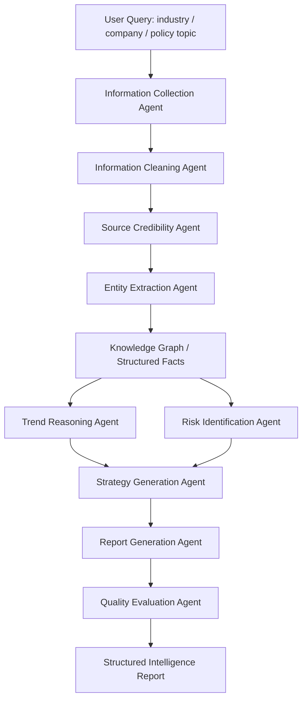

# CivicMind Agent

> AI 驱动的公共政策与商业决策情报分析 Skill 原型。  
> A multi-agent skill prototype for policy intelligence, market research, risk analysis and strategic decision reports.

## 项目定位

CivicMind Agent 是一个面向创业者、投资人、企业战略部门和政策研究人员的 AI 情报分析 Agent 原型。项目目标是把分散在政府公告、监管文件、行业报告、新闻资讯、上市公司公告、社交媒体和专家观点中的信息，自动整理成可用于决策的结构化情报报告。

该项目不是普通的摘要工具，而是一个围绕真实研究流程设计的多 Agent 工作流系统。它将“信息采集—来源可信度评估—结构化抽取—实体识别—趋势推理—风险识别—策略生成—报告输出”拆分为多个相互协作的 Agent，并通过长链推理形成证据链一致、逻辑链闭合、结论可追溯的研究报告。

## 核心痛点

现实中的政策、产业和商业信息高度分散。一个创业者想判断某个行业是否值得进入，通常需要同时阅读政策文件、补贴公告、监管趋势、竞品动态、融资新闻、市场规模数据、上市公司公告和舆论变化。传统研究流程耗时长、成本高、信息遗漏风险大，而且不同来源的信息质量参差不齐，人工判断容易受到个人经验、信息偏差和时间压力影响。

CivicMind Agent 试图解决以下问题：

| 痛点 | 传统方式问题 | CivicMind Agent 的处理方式 |
|---|---|---|
| 信息分散 | 需要人工搜索大量网页、报告和公告 | 通过信息采集 Agent 汇总多源材料 |
| 来源质量不一 | 自媒体、论坛、机构报告、政府公告混杂 | 通过可信度评估 Agent 对来源分层打分 |
| 长文本阅读成本高 | 政策文件、行业报告和财报篇幅长 | 通过结构化抽取 Agent 提取关键事实 |
| 结论难以追溯 | 人工报告经常只给结论，不保留证据链 | 报告中保留来源、时间线、证据和推理路径 |
| 风险识别不足 | 容易只看到机会，忽视监管和商业风险 | 风险 Agent 单独分析政策、合规、竞争和资金风险 |
| 输出不适配角色 | 创业者、投资人、研究员需要的信息不同 | 策略 Agent 按角色输出不同版本建议 |

## 目标用户

| 用户类型 | 典型使用场景 |
|---|---|
| 创业者 | 判断某个行业是否值得进入，识别政策机会和商业化路径 |
| 投资人 | 对公司、赛道、政策变化进行初步尽调和风险筛查 |
| 企业战略部门 | 跟踪监管政策、产业变化、竞品动态和区域机会 |
| 政策研究人员 | 快速整理政策文本、时间线、利益相关方和影响路径 |
| 内容研究团队 | 生成行业研究摘要、选题判断和趋势报告 |

## 典型使用场景

1. **行业进入分析**：例如分析 AI 法律服务、AI 短剧工具、跨境电商 SaaS、具身智能、低空经济等行业是否值得进入。
2. **政策影响分析**：例如判断某项监管新规对企业经营、内容平台、投资方向或商业模式的影响。
3. **公司与竞品研究**：例如自动分析某家公司近期融资、产品更新、招聘、舆论、商业模式和竞争态势变化。
4. **地区机会扫描**：例如对某个城市或产业园区的补贴政策、招商方向、产业集群和人才政策进行整理。
5. **事件影响评估**：例如对某个突发监管事件、行业舆情或公司公告进行影响路径分析。

## 系统架构



## 多 Agent 分工

| Agent | 职责 | 典型输出 |
|---|---|---|
| Information Collection Agent | 围绕行业、地区、公司或政策主题收集公开资料 | 政策公告、新闻、报告、财报、公司资料清单 |
| Information Cleaning Agent | 去重、过滤低质量信息、按来源和时间分类 | 清洗后的候选材料池 |
| Source Credibility Agent | 按来源权威性、时间新鲜度、事实密度评估可信度 | 来源评分、引用优先级、低可信来源标记 |
| Entity Extraction Agent | 抽取公司、行业、政策、地区、金额、监管部门、时间节点 | 结构化实体表、事件表、时间线 |
| Trend Reasoning Agent | 判断政策鼓励、监管收紧、需求变化、资本流向等趋势 | 趋势判断、关键驱动因素、证据链 |
| Risk Identification Agent | 识别政策、合规、竞争、商业模式、资金链、舆论风险 | 风险矩阵、严重程度、触发条件 |
| Strategy Generation Agent | 按用户角色生成策略建议 | 创业者/投资人/企业战略/研究员版本建议 |
| Report Generation Agent | 整合所有结果，输出结构化报告 | 摘要、结论、时间线、机会、风险、行动建议 |
| Quality Evaluation Agent | 检查逻辑一致性、证据充分性、结论可追溯性 | 质量评分、缺口清单、改进建议 |

## 工作流说明

一次完整任务通常包括以下步骤：

1. 用户输入研究主题，例如“分析 AI 法律服务行业是否值得进入”。
2. 系统将主题拆解为政策维度、市场维度、公司维度、产品维度、监管维度和商业模式维度。
3. 信息采集 Agent 获取相关材料，并按来源类型归类。
4. 信息清洗 Agent 删除重复内容、广告内容和弱相关内容。
5. 可信度评估 Agent 对来源进行权重判断，政府官网、交易所公告、公司财报和权威报告权重较高，社交媒体和论坛内容主要作为舆情线索。
6. 实体抽取 Agent 抽取公司、政策、地区、金额、时间节点、监管部门、产品和关键事件。
7. 趋势推理 Agent 基于结构化事实进行长链推理，判断行业是否处于政策鼓励、资本流入、监管收紧或需求扩张阶段。
8. 风险识别 Agent 生成风险矩阵，区分短期风险、长期风险、低概率高影响风险和高概率低影响风险。
9. 策略生成 Agent 按用户角色输出进入建议、投资观察点、研究重点或战略动作。
10. 报告生成 Agent 输出完整结构化报告。
11. 质量评估 Agent 检查证据链、逻辑链、引用完整性和结论稳健性。

## RAG 知识库设计

后续版本计划接入 RAG 知识库，用于提高事实准确性和结论可追溯性。

| 知识库类型 | 内容示例 | 用途 |
|---|---|---|
| 政策文件库 | 政府公告、部门规章、产业政策、补贴文件 | 判断政策方向和监管边界 |
| 行业报告库 | 券商研报、咨询报告、行业白皮书 | 提取市场规模、竞争格局和发展趋势 |
| 公司资料库 | 年报、公告、融资新闻、招聘信息、产品页 | 分析公司动态和竞品变化 |
| 风险规则库 | 合规风险、商业模式风险、舆情风险模板 | 标准化风险识别 |
| 报告模板库 | 行业进入分析、竞品研究、政策影响分析模板 | 提升报告稳定性和可读性 |

## 输出内容结构

一次标准输出包含：

- Executive Summary / 执行摘要
- Key Findings / 关键结论
- Evidence Map / 证据地图
- Timeline / 事件时间线
- Policy Signal / 政策信号
- Market Signal / 市场信号
- Competitive Landscape / 竞品格局
- Risk Matrix / 风险矩阵
- Opportunity Assessment / 机会判断
- Strategy Recommendations / 策略建议
- Unknowns & Follow-up Questions / 未确认信息与后续问题
- Source Credibility Notes / 来源可信度说明

## Token 使用需求说明

CivicMind Agent 具有高 token 使用需求。原因如下：

| 消耗环节 | Token 消耗原因 |
|---|---|
| 长文本输入 | 政策文件、行业报告、新闻报道、财报片段、用户资料通常篇幅较长 |
| 多源材料整合 | 需要同时处理多个来源，并保留来源之间的关系 |
| RAG 上下文拼接 | 检索结果需要进入上下文供模型分析 |
| 多 Agent 调用 | 每个 Agent 都需要单独分析和输出中间结果 |
| 长链推理 | 趋势判断、风险识别和策略生成需要多步推理 |
| 报告输出 | 最终报告包含摘要、证据链、风险矩阵、策略建议等长内容 |
| 批量测试 | 同一主题需要多次迭代和对比不同版本输出 |

一个完整研究任务可能包含 8 个以上 Agent 阶段，每个阶段都需要读取前置结果并生成新的结构化输出。如果进行批量行业研究或公司跟踪，token 消耗会进一步增加。因此该项目适合作为高 token 消耗、多 Agent 协作和长上下文推理的测试场景。

## 示例任务

示例输入：

```text
请分析 AI 法律服务行业是否值得进入，重点关注政策环境、监管风险、目标客户、竞品格局、商业化路径和未来 12 个月的行动建议。
```

示例输出摘要：

```text
结论：AI 法律服务行业存在明确需求，但进入策略不宜从通用法律问答切入，而应优先选择低风险、高频、流程化的细分场景，例如法律内容生产、合同初审辅助、法律营销素材生成、法规检索增强和律师内部知识库。主要风险包括法律服务资质边界、错误法律建议责任、用户隐私和数据合规。建议采用“工具辅助而非替代律师”的产品定位。
```

## Roadmap

| 阶段 | 目标 |
|---|---|
| v0.1 | 完成 Skill 文件、提示词、示例输入输出和模拟工作流 |
| v0.2 | 增加 Python Demo，支持本地模拟多 Agent 流程 |
| v0.3 | 接入 RAG 文档检索模块 |
| v0.4 | 增加来源可信度评分和风险矩阵模板 |
| v0.5 | 支持行业进入分析、政策影响分析、公司竞品研究三类报告 |
| v1.0 | 构建可视化工作流和批量报告生成能力 |

## 项目边界与合规声明

CivicMind Agent 输出内容仅用于研究辅助、信息整理和决策参考，不构成投资建议、法律意见、财务建议或政策承诺。系统在报告中应尽量保留来源、证据链和不确定性说明，避免将概率判断包装成确定性结论。对于投资、法律、财务和合规等高风险决策，仍应由专业人员进行最终判断。

## Repository Structure

```text
civicmind-agent-skill/
├── .skills/
│   └── civicmind-agent/
│       └── SKILL.md
├── docs/
│   ├── architecture.md
│   ├── data_sources.md
│   ├── evaluation_rubric.md
│   ├── security_compliance.md
│   └── token_usage.md
├── examples/
│   ├── input_ai_legal_service_industry.md
│   ├── output_ai_legal_service_report.md
│   ├── input_company_research.md
│   └── output_company_research_report.md
├── logs/
│   └── sample_run_log.md
├── prompts/
│   ├── agent_roles.md
│   ├── report_generation_prompt.md
│   ├── risk_analysis_prompt.md
│   ├── source_credibility_prompt.md
│   └── system_prompt.md
├── src/
│   └── civicmind_agent_demo.py
├── workflows/
│   └── civicmind.workflow.json
├── README.md
├── requirements.txt
└── LICENSE
```

## License

MIT License.
