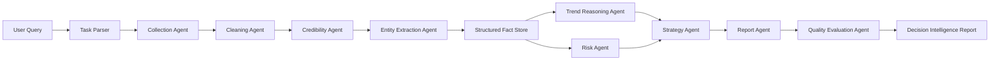

# Architecture

CivicMind Agent follows a staged multi-agent pipeline.

## Pipeline

1. **Research Task Parser**
   - Converts user query into a research plan.
   - Determines whether the task is industry analysis, policy analysis, company research or event impact analysis.

2. **Information Collection Layer**
   - Accepts user-provided documents.
   - Optionally integrates with search, filings, reports and news sources.

3. **Cleaning and Credibility Layer**
   - Deduplicates materials.
   - Scores sources by authority, recency, factual density and consistency.

4. **Extraction Layer**
   - Extracts entities, events, dates, amounts, institutions and signals.

5. **Reasoning Layer**
   - Trend reasoning.
   - Risk identification.
   - Opportunity assessment.
   - Scenario reasoning.

6. **Strategy Layer**
   - Generates recommendations for different user roles.

7. **Report Layer**
   - Produces a structured report.
   - Runs final quality evaluation.

## Mermaid Diagram

